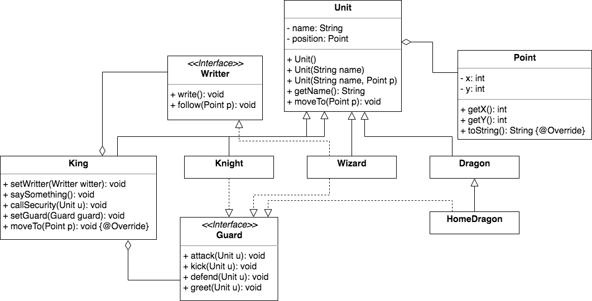

 

1. Доделайте реализацию метода follow() в классе Wizard, чтобы волшебник полностью реализовывал интерфейс Writter.

2. Создайте интрейфейс Guard и реализуйте его в классах Knight, Wizard, HomeDragon. Реализация на ваше усмотрение, развлекайтесь :)

3. В классе King обеспечте возможность устанавливать охранника и измените метод callSecurity, чтобы охранник выполнял приказы.

4. Поиграйтесь с подключением различных классов в качестве охранника к королю. 